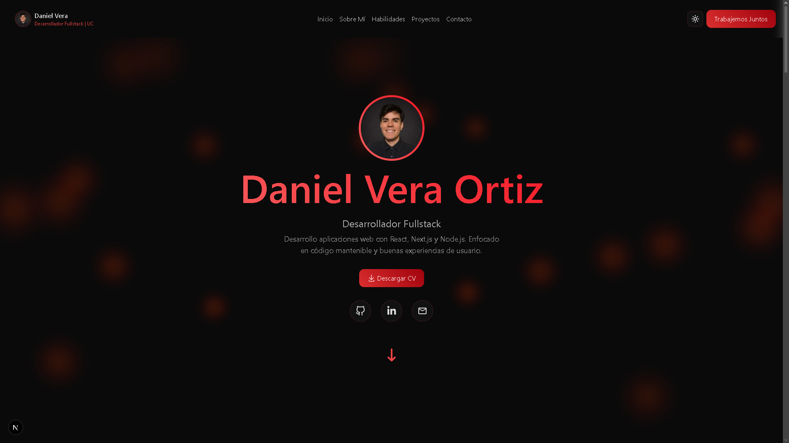
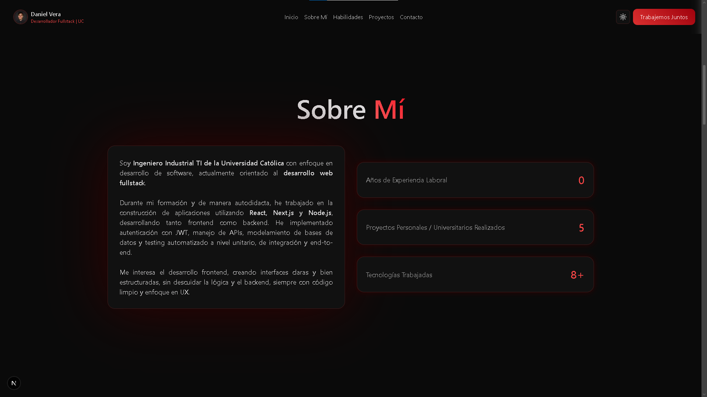
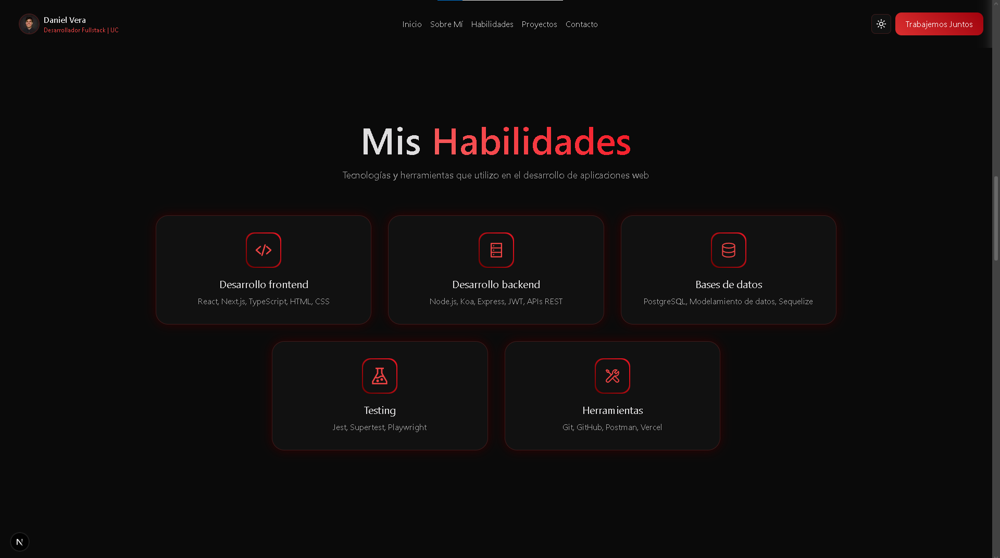
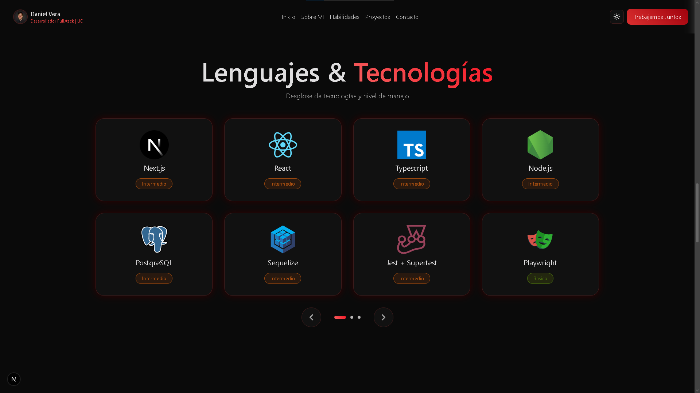
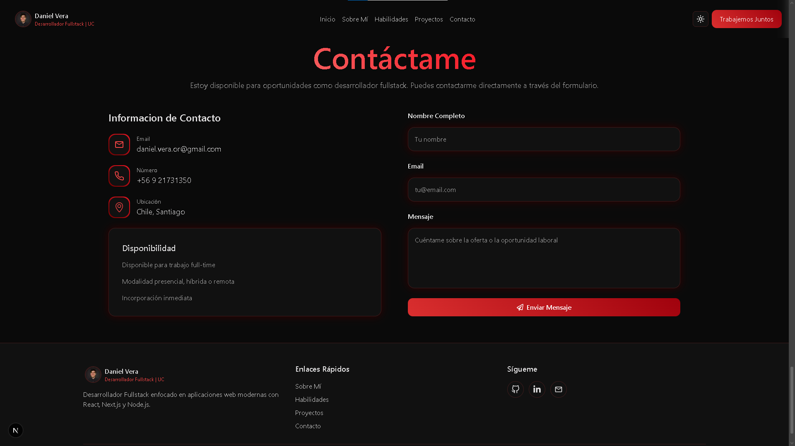
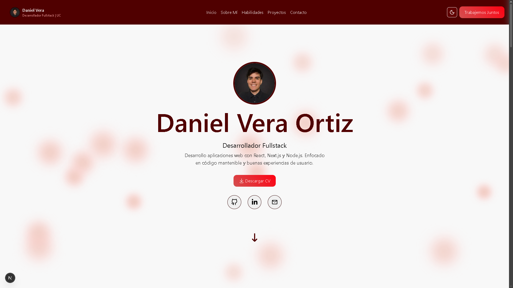
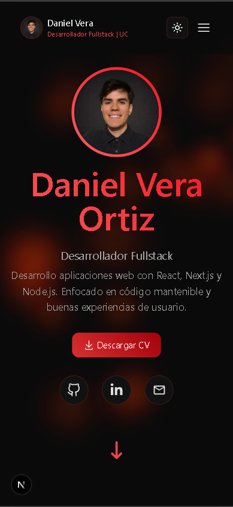
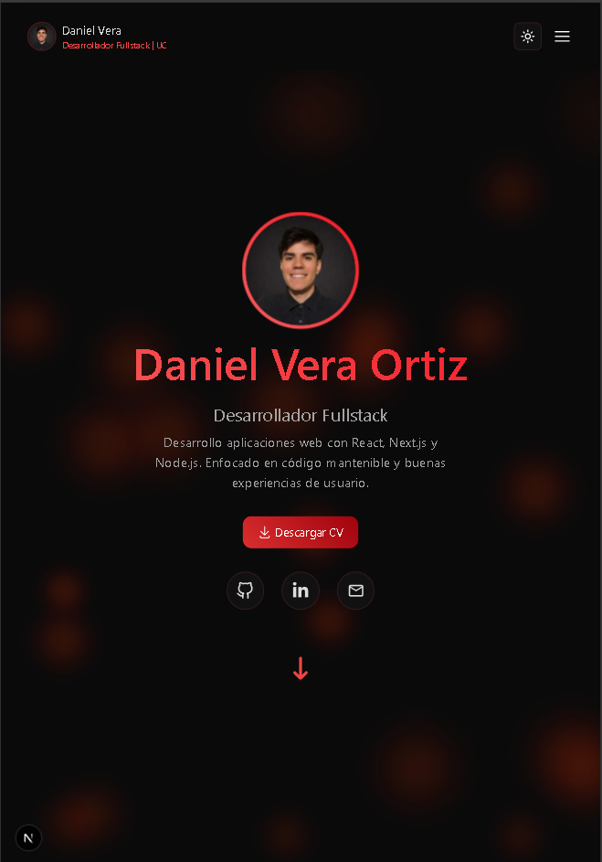

# 💼 Portafolio - Daniel Vera

Portafolio web desarrollado con Next.js para presentar mis proyectos, habilidades y experiencia como desarrollador fullstack.

---

## 🚀 Demo

🔗 https://tu-portafolio.vercel.app

---

## 🛠️ Tecnologías utilizadas

- ⚛️ React
- ▲ Next.js
- 🟦 TypeScript
- 🎨 Tailwind CSS
- 🎞️ Framer Motion

---

## ✨ Características

- 📱 Diseño responsive (mobile, tablet y desktop)
- 🎬 Animaciones fluidas con Framer Motion
- 🧩 Sección de proyectos con modal interactivo
- 📩 Formulario de contacto funcional
- ☁️ Despliegue en Vercel

---

## 📂 Proyectos destacados colocados en el portafolio

- 🎮 Aplicación web de juegos que consume una API externa, con autenticación JWT, backend propio, diseño responsivo y testing automatizado (Jest, Supertest y Playwright).
- 🐶 Proyecto de título para la Fundación Mascotalerta, desarrollando una plataforma para la gestión de animales en adopción, perdidos y hogares temporales. Participé en frontend y backend, integrando además un modelo de IA (Hugging Face) para identificar animales similares entre reportes.

---

## ⚙️ Instalación

1. Clonar el repositorio:

```bash
git clone https://github.com/tuusuario/tu-repo.git
```

2. Instalar dependencias:

```bash
npm install
```

3. Ejecutar el proyecto:

```bash
npm run dev
```

## 🖼️ Imágenes

### 🖥️ Computador













### 📱 Móbil

La página es completamente responsiva; se muestra solo una imagen por dispositivo como ejemplo para mantener el README conciso.




